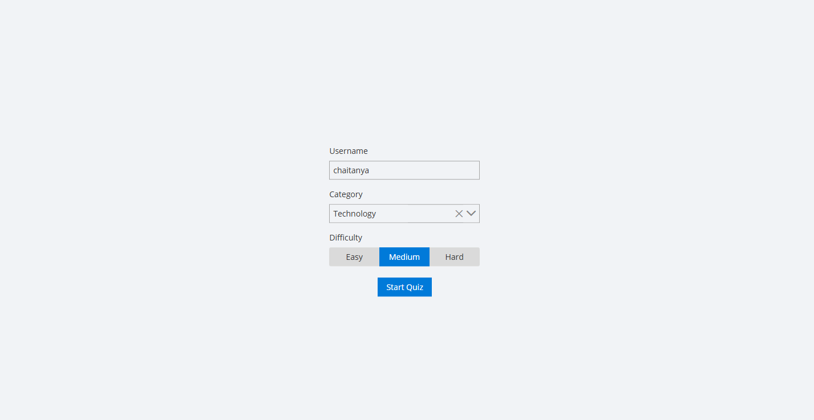
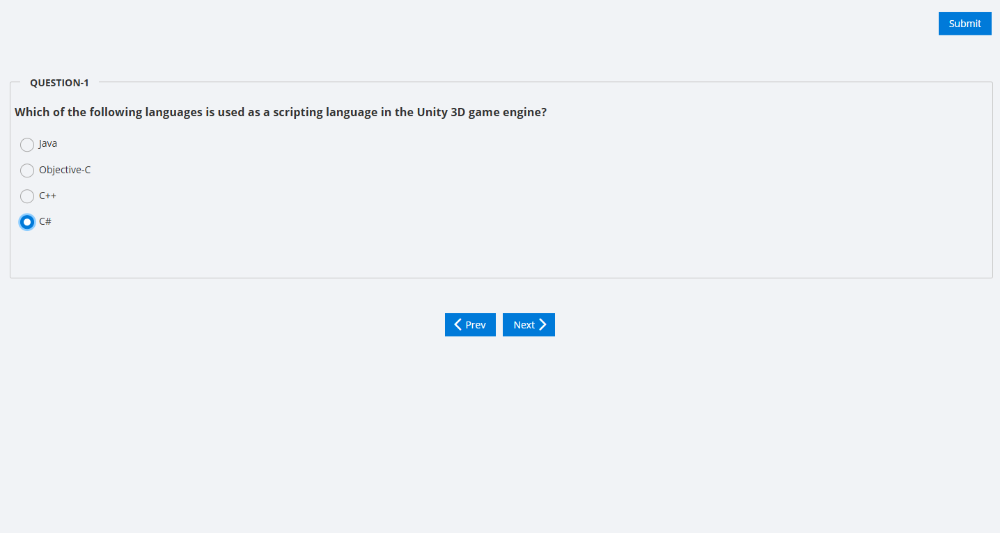
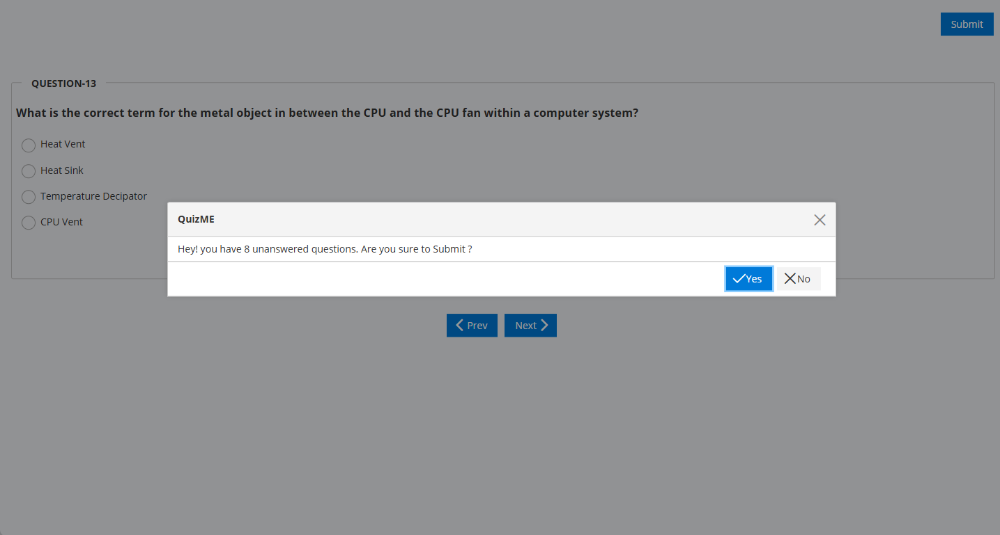
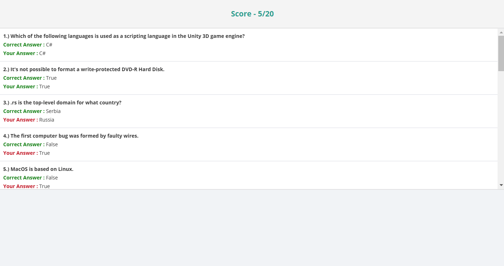

Certainly! Below is an updated version of the `README.md` file that includes sections for images illustrating each step of running the project. You can replace the placeholder image paths with the actual paths to your images.

```markdown
# Quizify

Quizify is an interactive quiz application built with Angular and PrimeNG. It allows users to take quizzes on various topics, track their scores, and view results in a user-friendly interface.

## Table of Contents

- [Features](#features)
- [Technologies Used](#technologies-used)
- [Installation](#installation)
- [Usage](#usage)
- [File Structure](#file-structure)
- [Contributing](#contributing)
- [License](#license)

## Features

- User-friendly interface for taking quizzes.
- Dynamic quiz generation based on user-selected categories and difficulty levels.
- Real-time score tracking and result display.
- Responsive design for various devices.
- Confirmation dialog before submitting the quiz.

## Technologies Used

- **Angular**: A platform for building mobile and desktop web applications.
- **PrimeNG**: A collection of rich UI components for Angular.
- **RxJS**: A library for reactive programming using Observables.
- **TypeScript**: A superset of JavaScript that compiles to plain JavaScript.
- **HTML/CSS**: For structuring and styling the application.

## Installation

To run the application locally, follow these steps:

1. Clone the repository:
   ```bash
   git clone https://github.com/yourusername/Quizify.git
   ```

2. Navigate to the project directory:
   ```bash
   cd Quizify
   ```

3. Install the required dependencies:
   ```bash
   npm install
   ```

4. Start the development server:
   ```bash
   ng serve
   ```

5. Open your browser and navigate to `http://localhost:4200`.

## Usage

### Step 1: Enter Username and Select Category and Difficulty Level



- Upon opening the application, you will be greeted with a welcome screen.
- Enter your username and select a quiz category and difficulty level.
- Click on "Start Quiz" to begin.

### Step 2: MCQ Questions Appear



- After starting the quiz, multiple-choice questions (MCQs) will appear with four options each.
- Answer the questions and navigate through them using the "Prev" and "Next" buttons.

### Step 3: Confirmation Dialog Before Submitting



- Once you have attempted all the questions, click on "Submit."
- A pop-up will appear asking, "Do you want to submit?"

### Step 4: View Results



- After submitting, the results will be displayed.
- You will see your score (e.g., scored / out of total questions).
- Below the score, each question will be listed with the correct answer and your answer.

## File Structure

```
quizzify/
├── app/
│   ├── app-routing.module.ts
│   ├── app.component.ts
│   ├── app.module.ts
│   ├── quiz/
│   │   ├── quiz.component.ts
│   │   ├── quiz.service.ts
│   │   └── ...
│   ├── welcome/
│   │   ├── welcome.component.ts
│   │   └── ...
│   ├── result/
│   │   ├── result.component.ts
│   │   └── ...
│   └── ...
├── environments/
│   ├── environment.ts
│   └── environment.prod.ts
├── index.html
├── styles.css
└── ...
